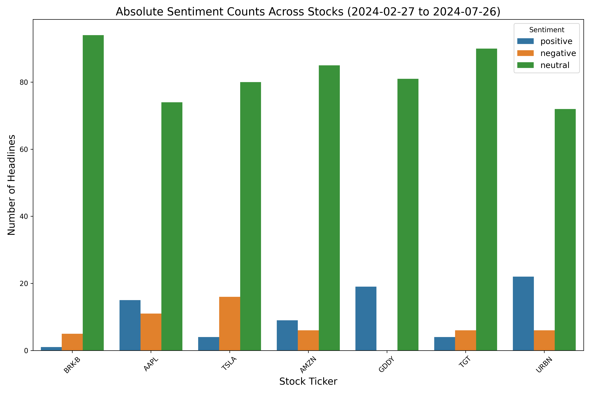
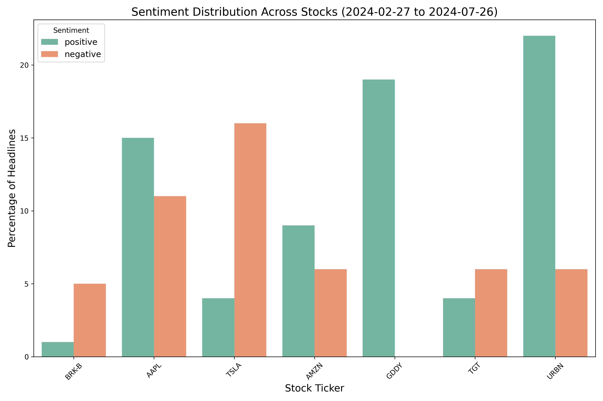

# Sentiment Analysis of Financial News using ULMFiT and AWD_LSTM

## Overview

This project aims to analyze sentiment in financial news headlines using the ULMFiT approach with the AWD_LSTM architecture, fine-tuned using the fastai library. The goal is to classify news headlines as positive, negative, or neutral and use these insights to identify the most positive and negative stocks on a given day.

## Project Structure

- **Data Preparation**: Scraped two years of financial news headlines from the web.
- **Language Model Fine-Tuning**: Fine-tuned the AWD_LSTM model to adapt to the financial domain's specific vocabulary.
- **Classifier Training**: Trained a classifier on labeled sentiment data to predict the sentiment of news headlines.
- **Deployment**: Deployed a web scraping tool to gather current financial news, analyze sentiment, and highlight stocks with the most positive and negative sentiments.

## Techniques Used

### ULMFiT (Universal Language Model Fine-tuning)

- **Transfer Learning**: Utilized pre-trained language models to capture general language patterns.
- **Discriminative Fine-Tuning**: Adjusted different learning rates for different layers of the model to refine the adaptation to the financial news domain.
- **Slanted Triangular Learning Rates**: Implemented a cyclical learning rate schedule to converge to an optimal solution quickly.

### AWD_LSTM (ASGD Weight-Dropped LSTM)

- Utilized for its regularization techniques and efficiency in handling sequence data, making it well-suited for language modeling tasks.

## Steps

### 1. Data Preparation

- Scraped financial news headlines and timestamps.
- Preprocessed the text data by tokenizing and numericalizing the inputs.

### 2. Language Model Fine-Tuning
- Fine-tuned the pre-trained AWD_LSTM model on the financial news dataset to capture domain-specific vocabulary and context.

### 3. Classifier Training

- Fine-tuned the language model's last layers to adapt it to the classification task.
- Evaluated the classifier using a separate test dataset.

### 4. Evaluation and Visualization

- Analyzed model performance using accuracy and F1 scores.
- Visualized sentiment distribution with bar plots.

### 5. Deployment

- Implemented a web scraper to collect real-time news headlines from financial news websites.
- Predicted the sentiment of each headline using the trained classifier.
- Aggregated the results to identify stocks with the most positive and negative sentiments.

## Outcome

The project successfully demonstrates the application of transfer learning in sentiment analysis of financial news. The model achieves an overall accuracy of 0.76, with F1 scores of 0.67 for negative, 0.83 for neutral, and 0.67 for positive sentiments.

### Sample Output Images

- 
- 

These images showcase the sentiment distribution across different stocks, providing insights into the overall market sentiment.

## Future Work

- Enhance model performance by addressing class imbalance in the dataset.
- Train the language model on a larger dataset of financial jargon to improve domain knowledge and sentiment prediction accuracy.
- Implement a user interface for easier interaction and visualization of sentiment trends.

## How to Run

1. **Clone the repository**: `git clone <repository-url>`
2. **Install dependencies**: Install necessary libraries
3. **Train the model**: Follow the steps in the provided Jupyter notebooks.
4. **Run the analysis**: Use the deployment script to scrape news and analyze sentiment.

## Conclusion

This project highlights the effectiveness of transfer learning and deep learning techniques in the financial domain, providing valuable insights for analysts and investors to make informed decisions.
